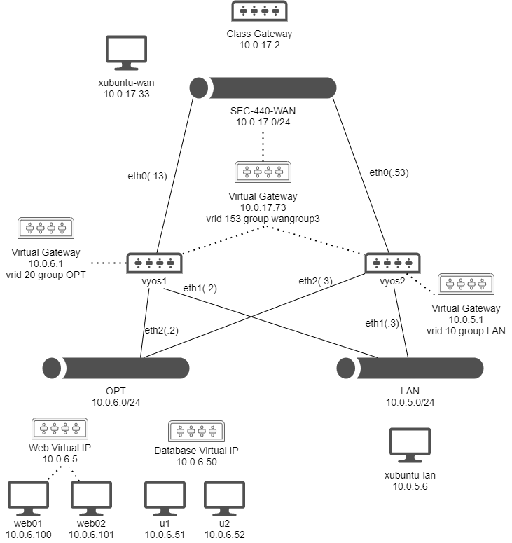
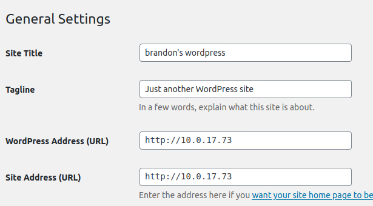

# Application Redundancy Lab

This lab addresses application redundancy with demonstrating web services across two devices and a remote database server instance. For this lab, two MySQL database servers were used with a WordPress Installation to show how redundancy can be achieved in another way. This would allow a firewall, web server, and database server all to simultaneously go down and still preserve the availability of information within the web application.

[Demonstration Link](https://drive.google.com/file/d/1Doc6ab5yvJfKDyy06FS4jqsipsNGUS5q/view?usp=sharing)

## Network Map

This week, the network diagram accommodated `u1` and `u2` as database servers:



## u1 and u2 Setup

As these two devices are Ubuntu servers, they were configured with netplan. On each device, edit `50-cloud-init.yaml` to make it look like the following. Substitute the `x` for the address bit that is being assigned:

```
network:
	ethernets:
		ens160:
			dhcp4: false
			addresses:
				- 10.0.6.x/24
			gateway4: 10.0.6.1
			nameservers:
				addresses:
					- 10.0.6.1
	version: 2
```

Upon saving this file, run `sudo netplan apply` to make this configuration active on each device.

For generic user profile creation:

```
adduser brandon
usermod -aG sudo brandon
```

Give each device a hostname (substitue `ux` for a meaningful hostname):

```
hostnamectl set-hostname ux
```

### Initial Database Setup

These databases will be redundant, and specific steps are required in the right order to ensure a smooth installation. A primary server will be first setup with the WordPress database that we need, and then it will be replicated over to the secondary for redundancy.

On each server, run updates and install MySQL Server:

```
sudo apt update -y && sudo apt upgrade -y && sudo apt install -y mysql-server && systemctl enable mysql
```

### u1 Initial Setup

The file `/etc/mysql/mysql.conf.d/mysqld.cnf` will handle the MySQL configuration changes that are needed to achieve redundancy. Within this file, underneath the `[mysqld]` header, make it look like the following:

```
bind-address = 0.0.0.0
server-id = 1
auto_increment_increment = 3
auto_increment_offset = 0
log_bin           = /var/log/mysql/log-bin
log_bin_index     = /var/log/mysql/log-bin.index
binlog_format     = row
expire_logs_days  = 10
log_slave_updates
```

This will make sure that the server listens on any address assigned, designates a server ID number, and configures logging that's needed later to establish redundant connections with `u2`. 

Next, startup and enable MySQL with `sudo systemctl enable mysql && sudo systemctl start mysql`. Jump into the MySQL terminal as the root user with `sudo mysql`. This should bring up a prompt where MySQL commands will be read. The following commands will make a wordpress user with sufficient privileges to work with a new database. Additionally, the `repslave` user will be created to connect both databases to synchronize data:

```
CREATE USER 'wpuser'@'%' IDENTIFIED BY 'secret';
CREATE DATABASE wordpress;
GRANT ALL PRIVILEGES ON wordpress.* TO wpuser@'%' IDENTIFIED BY 'secret';
GRANT REPLICATION slave ON *.* to 'repslave' identified by 'supersecret';
```

### u2 Initial Setup

This time on `u2`, edit `/etc/mysql/mysql.conf.d/mysqld.cnf` to include the following under `[mysqld]`:

```
bind-address = 0.0.0.0
server-id = 2
auto_increment_increment = 3
auto_increment_offset = 1
binlog_format     = row
expire_logs_days  = 10
```

This is slightly different than `u1`'s config file, as the log increment numbers will need to vary between the two hosts.

### A note on bind-address

This is set to be 0.0.0.0 to be open to the use of a virtual IP address. If this were bound to only the host's network address, connections aren't accepted via the virtual IP later assigned to these boxes.

### Primary -> Secondary Replication

The first step in replication is dumping out the database made on `u1` and pushing it onto the MySQL server on `u2`.

On `u1`:

```
sudo mysqldump --all-databases --flush-logs -q --master-data=1 --single-transaction -u root -p > /home/brandon/dump.sql
```

Now, from `u2`:

```
scp brandon@10.0.6.51:/home/brandon/dump.sql dump.sql
```

On `u2`, load the SQL dump file:

```
sudo mysql < dump.sql
```

Now that this is loaded into `u2`, a few more configuration changes need to be made in `/etc/mysql/mysql.conf.d/mysqld.cnf`:

```
log_bin           = /var/log/mysql/log-bin
log_bin_index     = /var/log/mysql/log-bin.index
```

Additionally, ensure that the password from `/etc/mysql/debian.cnf` matches on both boxes, if it is different on `u2`, delete it and make it match the same field in this file on `u1`. Push these changes into place with `sudo systemctl restart mysql`.

Still on `u2`, run:

```
head -n3 /var/lib/mysql/master.info
```

Note the second line that will serve as `MASTER_LOG_FILE` and the third line that will function as `MASTER_LOG_POS` in the command below. Hop back into a root MySQL prompt and enter in the following commands to enable replication:

```
SET GLOBAL master_info_repository = 'TABLE';
SET GLOBAL relay_log_info_repository = 'TABLE';
CHANGE MASTER TO MASTER_HOST='10.0.6.51', MASTER_USER='repslave', MASTER_PASSWORD='supersecret', MASTER_LOG_FILE='log-bin.000002', MASTER_LOG_POS=154 for channel 'primary';
start slave for channel 'primary';
```

Data should now be flowing from the primary server into the secondary. You can check the status of this with `show slave status for channel 'primary'\G`

### Secondary -> Primary Replication

The previous steps will ensure that changes made on `u1` go to `u2`, but the inverse is not yet true. The next steps will make data from `u2` flow back to `u1`.

From a root MySQL prompt on `u2`, run the following command:

```
SHOW MASTER STATUS;
```

Take note of "File" "Position" for use on the primary. These will function as `MASTER_LOG_FILE` and `MASTER_LOG_POSITION` respectively in the following command.

Using the values you obtained above, run the following from a root MySQL prompt on `u1`:

```
SET GLOBAL master_info_repository = 'TABLE';
SET GLOBAL relay_log_info_repository = 'TABLE';
CHANGE MASTER TO MASTER_HOST='10.0.6.52', MASTER_USER='repslave', MASTER_PASSWORD='supersecret', MASTER_LOG_FILE='log-bin.000001', MASTER_LOG_POS=154 for channel 'secondary_1';
start slave FOR CHANNEL 'secondary_1';
```

This should now ensure that data is replicated in both directions. Replication from `u2` to `u1` can be checked with the MySQL command `show slave status FOR CHANNEL 'secondary_1'\G`.

### Keepalived Configuration

This is very similar to what was used for web redundancy, but this time servicing MySQL. This will create a virtual IP address that is serviced by one MySQL server at a time. This will be used in the event that one server fails. On each database server, install Keepalived:

```
sudo apt -y install keepalived
```

Create a config file at `/etc/keepalived/keepalived.conf`. On `u1`:

```
vrrp_sync_group db1 {
    group {
        databases
    }
}
 
vrrp_instance databases {
    state PRIMARY
    interface ens160
    virtual_router_id 55
    priority 100
    advert_int 1
    unicast_peer {
        10.0.6.52/24
    }
    virtual_ipaddress {
        10.0.6.50/24
    }
}
```

Similarly on `u2`:

```
vrrp_sync_group db1 {
    group {
        databases
    }
}
 
vrrp_instance databases {
    state BACKUP
    interface ens160
    virtual_router_id 55
    priority 99
    advert_int 1
    unicast_peer {
        10.0.6.51/24
    }
    virtual_ipaddress {
        10.0.6.50/24
    }
}
```

Enable Keepalived at boot and run it on both servers:

```
sudo systemctl enable keepalived
sudo systemctl start keepalived
```

Success on this step can be confirmed by running `ip addr` on each of these devices. If `u1` assumes primary status, it should have both the addresses `10.0.6.50` and `10.0.6.51`.

## web01 and web02 Setup

WordPress was chosen as the web application to run on the database servers in this lab. Clear out any existing content in `/var/www/html/` on each server. The existing `httpd` server will be used to serve up WordPress content.

### A Note on SELinux

By default, SELinux is enabled in CentOS 7. Significant time was spent here troubleshooting, as SELinux got in the way of successful database communication. This is a means for mandatory access control (MAC) in Linux on top of discretionary access control (DAC), but isn't necessary in this case. To speed things up, turn it off with `setenforce 0`. To make this change persist across reboots, edit `/etc/sysconfig/selinux` and set `SELINUX=disabled` within the file.

### Initial Dependencies

On both web servers, install dependencies so WordPress can run PHP and talk to remote MySQL databases:

```
wget http://repo.mysql.com/mysql-community-release-el7-5.noarch.rpm
rpm -ivh mysql-community-release-el7-5.noarch.rpm
sudo yum update -y && sudo yum install mysql -y
sudo yum install epel-release yum-utils
sudo yum install http://rpms.remirepo.net/enterprise/remi-release-7.rpm -y
sudo yum-config-manager --enable remi-php74
sudo yum install php74-php-fpm mysql php74 php-common php-mysqlnd -y
```

Multiple versions of PHP are available, but the above dependencies were used to make the latest WordPress version function at the time of writing.

### WordPress Installation

WordPress will first be installed on `web01` where files will be changed and initial database updates will be made. Don't run these same commands on the second web server, as database changes take place during the install and only need to happen once.

Download the latest version of WordPress and extract it from your named user's home folder:

```
wget https://wordpress.org/latest.tar.gz
tar -xzvf latest.tar.gz
```

Copy this over into the servable web directory and change ownership of the files to `apache`:

```
sudo rsync -avP /home/brandon/wordpress/* /var/www/html/
sudo chown -R apache:apache /var/www/html/*
```

Rename a copy of `wp-config-sample.php` to `wp-config.php`. This will hold our values that we need for pointing WordPress to the correct resources. For this lab, the file contained the following values:

```
define( 'DB_NAME', 'wordpress' );
define( 'DB_USER', 'wpuser' );
define( 'DB_PASSWORD', 'secret' );
define( 'DB_HOST', '10.0.6.50:3306' );
```

Finally, make sure the web service notes these changes:

```
systemctl reload httpd
```

Navigate (from the LAN) to the IP address of `web01`. Step through other configuration steps as required in the GUI, including creating a WordPress user until a sample WordPress site is running normally. As the final goal in this is to get this site routable through the WAN, make sure that under General Setting in the web GUI to change the WordPress Address and Site Address:



Note that this will effectively stop WordPress from servicing requests to devices in the LAN or OPT networks.

If this GUI option is causing trouble, this can be defined directly in `wp-config.php`, overriding what is specified in the GUI:

```
define( 'WP_HOME', '10.0.17.73' );
define( 'WP_SITEURL', '10.0.17.73' );
```

### web02 redundancy

Now that WordPress is talking to the redundant database, `web02`'s setup is easy. This will work by copying all files out of the web directory on `web01` and placing them directly in the same spot of `web02`. Any previous installation steps don't need to be repeated, as the database is already populated. From `web02`, copy the files over:

```
sudo rsync -avP brandon@10.0.6.100:/var/www/html/* /var/www/html/
```

Now run `sudo systemctl reload httpd` and `web02` should be able to function identically to `web01`.

### Firewall Changes

No significant firewall changes were required for this lab other than temporary firewall changes to allow devices in the OPT to communicate out for installing services on devices.

References:
* [https://blog.k.io/atech/mysql-mariadb-replication-redundancy](https://blog.k.io/atech/mysql-mariadb-replication-redundancy)
* [https://dev.mysql.com/doc/refman/8.0/en/](https://dev.mysql.com/doc/refman/8.0/en/)
* [https://wordpress.org/support/article/how-to-install-wordpress/](https://wordpress.org/support/article/how-to-install-wordpress/)
