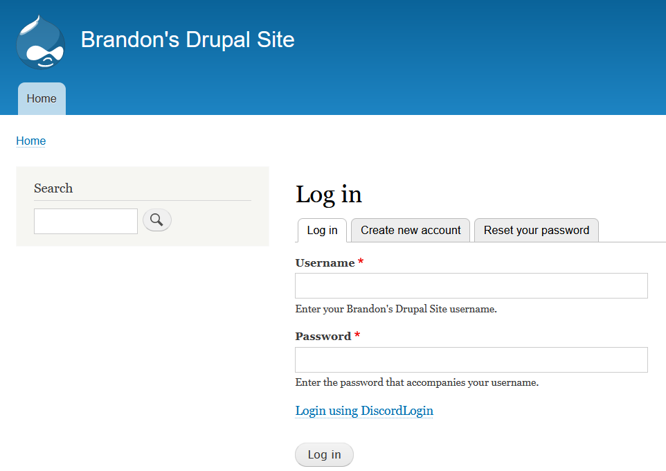

# Federated Identity Lab

For this lab, Federated Identity was demonstrated by installing Drupal on Amazon Web Services and integrating Discord authentication as the identity provider. A RHEL 8 image was deployed in AWS EC2 for the entirety of the web server installation. Though more efficient installations in a production environment could be achieved by using Amazon RDS and S3 buckets, this is a guide that could be followed on a single machine outside of the cloud. Drupal 8 was chosen for compatibility with federated identity plugins.

## Installing LAMP and Drupal 8 on an Amazon EC2 instance

Creating an Amazon EC2 instance is relatively easy [and is documented clearly here.](https://docs.aws.amazon.com/efs/latest/ug/gs-step-one-create-ec2-resources.html) For this installation, I chose a free tier RHEL 8 image. Configure the security group to allow SSH, HTTP and HTTPS traffic (TCP ports 22, 80 and 443) to the instance. In the EC2 console, take note of the public IPv4 DNS address of the instance; this will be used throughout the installation.

Install packages and enable at boot:

```
sudo yum update -y && sudo yum install mariadb mariadb-server httpd -y && sudo yum install wget -y
sudo systemctl enable mariadb
sudo systemctl enable httpd
```

Enable PHP 7.3, a requirement for the latest version of Drupal:

```
sudo yum -y install https://dl.fedoraproject.org/pub/epel/epel-release-latest-8.noarch.rpm
sudo yum -y install https://rpms.remirepo.net/enterprise/remi-release-8.rpm
sudo dnf -y install dnf-utils
sudo dnf -y module install php:remi-7.4
sudo yum -y install php-gd php-pdo
```

Startup these services:

```
sudo systemctl start httpd
sudo systemctl start mariadb
```

Setup MariaDB thorugh `sudo mysql_secure_installation`. Choose a password and answer prompts to best fit your environment.

Create MariaDB database and configure a user. Enter a MariaDB prompt with `mysql -u root -p`

```
CREATE DATABASE drupal;
GRANT ALL ON drupal.* TO 'drupal_user'@'localhost' IDENTIFIED BY 'secret';
FLUSH PRIVILEGES;
EXIT;
```

Restart the database service with `sudo systemctl restart mariadb`

Download Drupal 8's latest tarball:

```
wget https://ftp.drupal.org/files/projects/drupal-8.9.7.tar.gz
```

Extract the archive and move it to a web-servable directory. Use the filename appropriate to your extracted archive:

```
tar -xvf drupal-8.9.7.tar.gz
sudo mv drupal-8.9.7 /var/www/html/drupal
```

Make sure apache owns the directory:

```
sudo chown -R apache:apache /var/www/html/drupal
```

Copy the settings file so Drupal is populated with defaults:

```
sudo cp -p /var/www/html/drupal/sites/default/default.settings.php /var/www/html/drupal/sites/default/settings.php
```

### Changing `httpd.conf`

Underneath the `<Directory "/var/www/html">` header within `/etc/httpd/conf/httpd.conf`, make sure the following line exists:

```
AllowOverride All
```

This is necessary to ensure that Drupal pages can be accessed without error on the server.

### Configure HTTPS

The following command will install `mod_ssl` for the web server, create a private key directory, modify permissions, and generate a server certificate and a key file. When prompted by openssl, enter information into the certificate as you see fit. This information will be visible to visitors of the site when viewing certificate information.

```
sudo yum -y install mod_ssl
sudo mkdir /etc/ssl/private
sudo chmod 700 /etc/ssl/private
sudo openssl req -x509 -nodes -days 365 -newkey rsa:2048 -keyout /etc/ssl/private/apache-selfsigned.key -out /etc/ssl/certs/apache-selfsigned.crt
```

Edit `/etc/httpd/conf.d/ssl.conf`.

Underneath `<VirtualHost _default_:443>`, add the following lines. Use your ec2 public DNS address for `ServerName`:

```
DocumentRoot "/var/www/html/drupal"
ServerName <PUBLIC-HOSTNAME-HERE>:443
SSLCertificateFile /etc/ssl/certs/apache-selfsigned.crt
SSLCertificateKeyFile /etc/ssl/private/apache-selfsigned.key
```

Edit `/etc/httpd/conf/httpd.conf`, again using your ec2 public DNS address where needed:

```
<VirtualHost *:80>
	ServerName <PUBLIC-HOSTNAME-HERE>
	Redirect "/" "https://<PUBLIC-HOSTNAME-HERE>/drupal"
</VirtualHost>
```

Finally, make sure to turn off SELinux, as this will disrupt the normal operations of the web server and we don't need it in this use case. Make sure the line in `/etc/sysconfig/selinux` is set to `SELINUX=disabled` to turn it off across reboots, and run the command `sudo setenforce 0` to turn it off immediately.

Restart the web server with `sudo systemctl restart httpd`. Navigating to the site's public DNS address should redirect you to the Drupal instance. Proceed with the Drupal installation from the web GUI.


## Federated Identity Configuration

Download Composer:

```
sudo curl -sS https://getcomposer.org/installer | sudo php
sudo mv composer.phar /usr/local/bin/composer
sudo ln -s /usr/local/bin/composer /usr/bin/composer
```

To make sure Composer works properly for the installation, change the following value in `/etc/php.ini`:

```
memory_limit = -1
```

I found that composer tended to eat up a lot of memory on my ec2 instance and kept throwing me errors while trying to install this. I found one solution [here](https://stackoverflow.com/a/24648506) that involves creating a swap. 4GB is likely overkill, but this is a free-tier EC2 instance that only has 1GB of RAM.

```
sudo /bin/dd if=/dev/zero of=/var/swap.1 bs=1M count=4096
sudo /sbin/mkswap /var/swap.1
sudo /sbin/swapon /var/swap.1
```

Additionally, I needed git and unzip for things to work properly with the Composer installations of Drupal plugins. Install it with `sudo yum -y install git && sudo yum -y install unzip`.

Install the plugin to allow Discord authentication through Drupal. From inside `/var/www/html/drupal`, run:

```
sudo composer require drupal/miniorange_oauth_client
sudo composer update
```

Navigate to `<PUBLIC-HOSTNAME-HERE>/drupal/admin/modules` and select `miniOrange OAuth Client`, then click Install.

### Discord Configuration

With a Discord account, go to https://discord.com/developers/applications and create an application after logging in. Specify a name and icon for the app, and take note of your Client ID and Secret. Now, in the configuration tab in the Drupal web interface, select `Drupal OAuth Client Configuration`. Click through the steps provided; this module will guide you to fill in the appropriate fields. Be sure to copy the redirect URL back into the Discord client when needed.

After completing these steps, using the `Test Configuration` button provided, and pasting in attribute / role mappings, Drupal should allow users to login with OAuth. 

### miniOrange free plan drawbacks

Your Drupal username must match an already existing user on the server, so new users will not be able to login without an administrator creating a new user. Though new users must be created with Drupal passwords by an administrator, authentication can still be achieved entirely through Discord without the need to use the Drupal password at all. Paid plans of this plugin allow the creation of new users via OAuth.

## Using Federated Login

With this plugin configured in Drupal, you should be able to login to your instance by navigating to your site and going to the standard login screen for Drupal. A link is automatically generated on this screen to allow authentication via Drupal:




## References:
* [https://www.tecmint.com/install-drupal-on-centos-8/](https://www.tecmint.com/install-drupal-on-centos-8/)
* [https://yallalabs.com/linux/how-to-install-mariadb-10-3-on-centosrhel-7/](https://yallalabs.com/linux/how-to-install-mariadb-10-3-on-centosrhel-7/)
* [https://www.digitalocean.com/community/tutorials/how-to-create-an-ssl-certificate-on-apache-for-centos-7](https://www.digitalocean.com/community/tutorials/how-to-create-an-ssl-certificate-on-apache-for-centos-7)
* [https://www.drupal.org/project/miniorange_oauth_client](https://www.drupal.org/project/miniorange_oauth_client)
* [https://computingforgeeks.com/how-to-install-php-7-4-on-centos-rhel-8/](https://computingforgeeks.com/how-to-install-php-7-4-on-centos-rhel-8/)