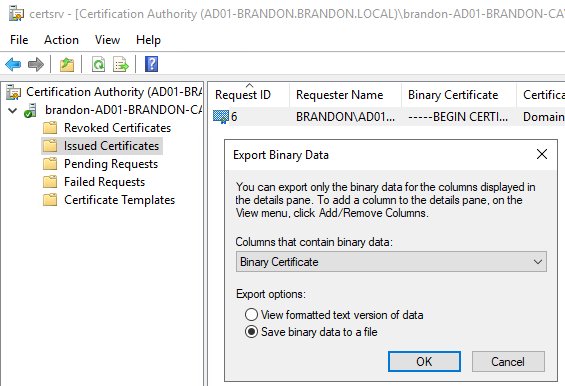
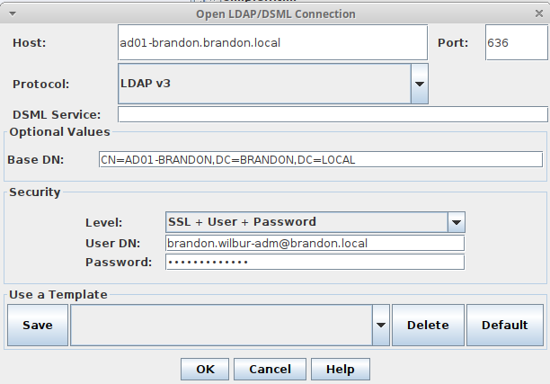

# LDAP Security Lab

This lab explores how to enable TLS to secure otherwise plaintext LDAP connections within Active Directory. By default, LDAP will transmit credentials in the clear over a network. This example will show how to use Windows Server 2019 as a certificate authority, and use its own certificate to encrypt connections. An Xubuntu system with JXplorer installed was used to establish LDAP connections to the active directory server.

## Install a Certificate Authority on Server 2019

From an administrative PowerShell prompt:

```
Add-WindowsFeature Adcs-Cert-Authority -IncludeManagementTools
Install-AdcsCertificationAuthority -CAType EnterpriseRootCA
```

After confirming configuration steps, a default certificate for the CA will be created. Export the newly created root certificate for installation on the client:



## Installing a Certificate on Xubuntu

Using SCP or another secure channel, move the certificate over to the client from the server:

```
scp cert.crt champuser@10.0.5.6:/home/champuser/Downloads/cert.crt
```

Now, on xubuntu-lan, move the cert and run the certificate update utility:

```
sudo mv cert.crt /usr/local/share/ca-certificates/
sudo update-ca-certificates
```

## Connecting to LDAP securely

Specify the following options within JXplorer to establish a secure LDAP connection to Active Directory:



When running a traffic capture, LDAP communications should be wrapped inside of TLS. Note that port 636 is reserved for LDAP over TLS.

## Reflection

The most difficult part of this lab was understanding conceptually what needed to be done to enable secure communications. DNS and search domains needed to be updated on the xubuntu-lan system in order to access the server securely. Once it was understood that a certificate authority needed to be leveraged and a certificate needed to be assigned to active directory and then installed on the client, the actual configuration steps to put this change in place were simple.

## References

* [https://docs.microsoft.com/en-us/troubleshoot/windows-server/identity/enable-ldap-over-ssl-3rd-certification-authority#:~:text=Summary,Layer%20Security%20(TLS)%20technology.](https://docs.microsoft.com/en-us/troubleshoot/windows-server/identity/enable-ldap-over-ssl-3rd-certification-authority#:~:text=Summary,Layer%20Security%20(TLS)%20technology.)