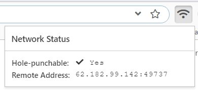
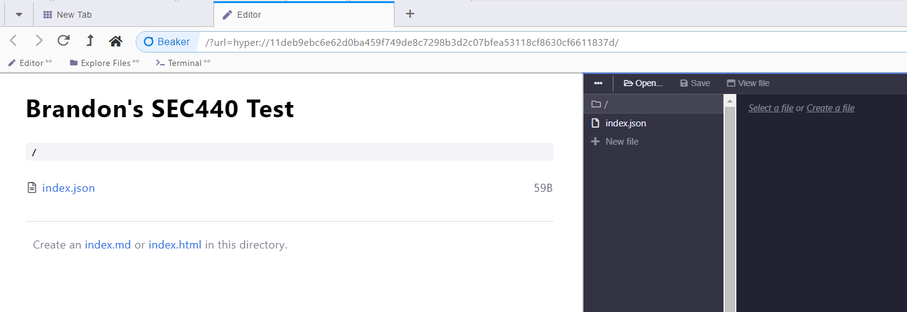
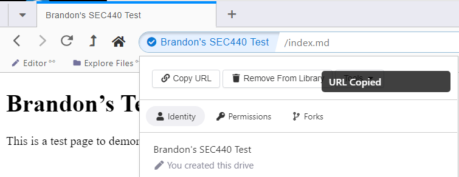
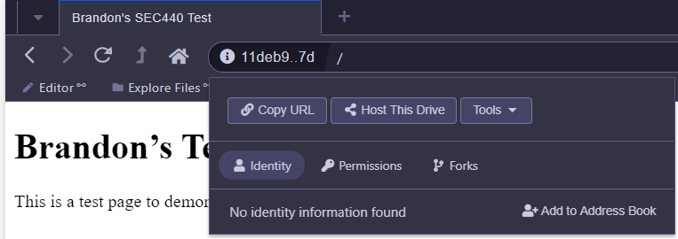

# Network Privacy Project

For this project, I chose to evaluate the [Beaker Browser](https://beakerbrowser.com/). This is a full web browser that features the use of the Hyperdrive, [part of the Hypercore protocol](https://github.com/hypercore-protocol), for peer-to-peer website hosting. When using this browser, Hyperdrive pages are accessed via `hyper://` preceding the peer's drive key. The goal of this project is to create a decentralized web while still guaranteeing authenticity of hosted content.

## Hyperdrive Protocol Deep Dive

The Beaker Browser Docs give a [decent description of the protocol](https://docs.beakerbrowser.com/developers/introduction-to-hyperdrive) that is being used to serve up content. As a peer-to-peer network, the team acknowledges that many traits are shared with BitTorrent. The main way that peers are networked is with a [Distributed Hash Table (DHT)](https://en.wikipedia.org/wiki/Distributed_hash_table). This powers the Beaker browser by mapping content to the hash of a drive's public key. This protocol that actually allows peers to connect to other Hyperdrives is called Hyperswarm. In the DHT, routing information is published (IP address and port) to peers to establish connections.

Only the author posessing the private key associated with the drive's public key can author and change content hosted within. Drives are referenced in the browser by this public key, which is a 64-character hexadecimal string. Content within a Hyperdrive can be navigated to as usual by specifying backslashes when traversing directories. At the time of evaluation, Beaker does not support sharing one browser's private key with multiple users for collaborating authors. 

Similarly to seeding used in torrenting, Hyperdrives can be co-hosted by other peers using the Beaker Browser. Because this private key required to change the content hosted on a drive, any client who has a Hyperdrive's public key can co-host a drive.

### Networking Considerations

When peers on the internet want to share content, either a public IP address or a specific NAT configuration is usually needed to forward traffic to the right device. Especially considering that the Beaker Browser is intended to be run on clients, this can be confusing. The answer that the Hyperswarm protocol uses is UDP holepunching on NAT networks.

UDP holepunching is taking advantage of port address translation (PAT) when NAT is configured for clients. By sending UDP packets out of the NAT network on a specific port, a temporary firewall rule will be implemented to allow that device with a private IP address to receive data back from the external device. By using this strategy and broadcasting to other peers the port that can be used to connect to a peer, Hyperswarm is automatically configuring temporary NAT rules on a client's router.

Holepunching may not always work due to discrepancies between vendors implementations of the protocol and possible layered NAT. On both xubuntu-wan and xubuntu-lan in my SEC440 environment, I was not able to obtain a hole-punchable status with the Beaker Browser, meaning that I could not successfully host content for other peers to connect to. This is because even though my xubuntu-wan machine is on a virtual public network, there is still at least one layer of NAT separating the device from a true public IP. Relying on multiple routers to dynamically configure PAT rules to forward traffic to each other can have varying degrees of success.

Additionally, Hyperswarm takes this technique and applies it amongst peers such that one connected peer should be able to relay another connection between two peers if direct network communications are not possible. Once communications are established, encryption is added via the [Noise protocol](https://noiseprotocol.org/) for end-to-end encryption. This is different than HTTPS but serves the same purpose of securing communications over the wire.

## Beaker Browser Usage

After firing up Beaker Browser, a Network Status button is available to check if you can host content. If the network is Hole-punchable, you should be good to go to start hosting content on a Hyperdrive:

To create a new Hyperdrive, click the options drop-down near the top right corner and name the drive. Now, click the editor bookmark to start adding content:

Content can be added in HTML or Markdown format; Markdown is generally easier to create sites with but offers less flexibility than HTML. The base page that will be displayed when navigating to the Hyperdrive URI must be named `index.html` or `index.md`. Place this page at the base of the Hyperdrive and copy the URL of the drive:

Place this URL in the URI bar of another Beaker Browser instance; you should be able to achieve connectivity across two segmented networks if each browser is in a hole-punchable state.

## Co-Hosting a Hyperdrive

Co-Hosting a Hyperdrive in Beaker Browser only requires clicking `Host This Drive` in a different peer's browser:

Now, the Hyperdrive should be accessible so long as one of the hosting clients is online. Though the co-hosting peer cannot modify the contents of the Hyperdrive, they can host it and resources will be accessible even if the author peer goes offline.

## Additional Considerations

Beaker Browser is still in a beta stage and isn't overly reliable at the time of writing. While at times I could successfully connect to a Hyperdrive created on my host machine or a hole-punchable virtual machine, I could sometimes not connect to a remote Hyperdrive from machines in my SEC440 environment. While this client shouldn't require hole-punchability to connect to a remote site, it's possible that the DHT that powers this transfer of data isn't updated quickly enough. This is something that may get mitigated once more clients participate in the network and the service gains popularity.

Additionally, Hyperdrive can be configured using command-line tools with the [Hyperdrive daemon](https://github.com/hypercore-protocol/hyperdrive-daemon). This could be better suited to a server installation that could be left running to ensure connectivity to the files stored.

When connecting to a remote Hyperdrive, the IP address and port of the remote peer will be exposed; this is by design in the protocol. This can be mitigated through the use of a VPN or proxy if possible, but mileage again may vary depending on NAT configurations possibly getting affected.

## References
* https://beakerbrowser.com/
* https://hypercore-protocol.org/