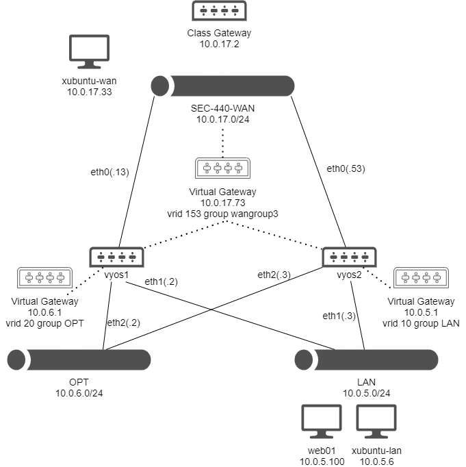

# Network Redundancy Lab

This lab addresses network redundancy by using VRRP (Virtual Router Redundancy Protocol) for gateways that other hosts can use. This allows one firewall to go down and communications within the network won't be interrupted. [Ansible was leveraged](ansible_automation.md) to automate the configuration of these two devices.

## Network Map



## VyOS 1 and 2 Setup

Aside from interface assignments and enabling SSH that can be found in configuration files from [VyOS 1](https://github.com/brandon-wilbur/sec440/blob/master/network_redundancy/vyos1_config.txt) and [VyOS 2](https://github.com/brandon-wilbur/sec440/blob/master/network_redundancy/vyos2_config.txt), all firewall configurations and high-availability confgurations were added via [an Ansible playbook](https://github.com/brandon-wilbur/sec440/blob/master/network_redundancy/firewall-config-playbook.yml). Here's an overview of the various firewalls in the environment:

# WAN-to-LAN
* Allow established connections back in
* Allow Port 80 for HTTP traffic to web01
* Allow Port 22 for SSH traffic to web01

# LAN-to-WAN
* Allow any connection out

There's currently no devices sitting on the OPT network, so these firewalls will currently drop all traffic:

* WAN-to-OPT
* OPT-to-WAN
* OPT-to-LAN
* LAN-to-OPT

NAT configuration needs to be set up to forward connections hitting the virtual gateway to devices inside the LAN and to masquerade connections initiated from the LAN. The following rules do this:

# NAT destination rule 10
* Take connections to the WAN virtual gateway over port 80 and send them to web01

# NAT destination rule 20
* Take connections to the WAN virtual gateway over port 22 and forward them to web01

# NAT source rule 10
* Masquerade IP addresses from the LAN connecting out to the Internet

## High Availability Setup

For High Availability Configuration, virtual addresses need to be setup that are served by both firewalls. This was done by creating VRRP groups and VRIDs that allowed each firewall to sync with for each virtual interface. This is mostly handled by the Ansible playbook, but I made the other changes by hand:

# VyOS 1

This was my primary node, so I issued the following commands:

```
set high-availability vrrp group wangroup3 peer-address 10.0.17.53
set high-availability vrrp group wangroup3 priority 255
set high-availability vrrp group LAN peer-address 10.0.5.3
set high-availability vrrp group LAN priority 255
```

This ensures that my firewall will only look towards the firewall addresses at VyOS 2's location for a peer and that VyOS 1 will be elected to be the primary node on startup.

# VyOS 2

As the secondary node, the commands looked like the following:

```
set high-availability vrrp group wangroup3 peer-address 10.0.17.13
set high-availability vrrp group wangroup3 priority 1
set high-availability vrrp group LAN peer-address 10.0.5.2
set high-availability vrrp group LAN priority 1
```

This should elect this router as a secondary node with the lowest priority level.

## Web01 setup

Initial interface and hostname assignments were done via `nmtui`. Setting up a new user and installing a simple web server were simple:

```
sudo adduser brandon
sudo usermod -aG wheel brandon
sudo yum -y update && sudo yum -y install httpd
sudo firewall-cmd --add-port=80/tcp --permanent && firewall-cmd --reload
sudo systemctl enable httpd && sudo systemctl start httpd
```

Create a file called `index.html` in `/var/www/html` with some sample text and then call the command `sudo systemctl reload httpd` to serve up your page.

# Setting up MFA on CentOS 7

Setting up multifactor authentication using Google Authenticator on CentOS will require a one-time code on each login in addition to a password. This is easy to setup and will require a mobile device to generate one-time codes. Run the following to install Google Authenticator on web01 and configure the application:

```
sudo yum -y install epel-release
sudo yum -y install google-authenticator
google-authenticator
```

Scan the QR code with a mobile device and take note of the one-time backup codes. Since this machine isn't publicly accessible outside of the lab environment, I chose to set time skew options to be very lenient.

Now, append the following text to `/etc/pam.d/sshd`:

```
auth    required      pam_unix.so     try_first_pass
auth    required      pam_google_authenticator.so
```

Comment / uncomment lines within `/etc/ssh/sshd_config` to include the following:

```
ChallengeResponseAuthentication yes

Match User brandon
    AuthenticationMethods keyboard-interactive
```

Now, researt SSH via `sudo systemctl restart sshd` or reboot the machine. On the next login, you should be prompted for a two factor code.

## Reflections

The configuration of these firewalls was greatly sped up by using Ansible. Having playbooks on hand is extremely useful for future reference as it lays out the commands that could be used in manual configuration mode as well. Though it can be difficult initially understanding how SSH key authentication works, it's a worthwhile payoff for quicker setup in the future. Furthermore, this was complicated by some changes that I made to high availability configurations by hand versus with Ansible. I ran into issues with primary / secondary nodes with VRRP and didn't understand this issue until after I had crafted my playbook. Overall, I still feel that while I didn't save time looking for automations, I learned more in a similar amount of time that I would have spend by hand.

## References:
* [https://www.techsupportpk.com/2020/03/how-to-enable-two-factor-authentication-ssh-centos-rhel-7-8.html](https://www.techsupportpk.com/2020/03/how-to-enable-two-factor-authentication-ssh-centos-rhel-7-8.html)
* [https://wiki.vyos.net/wiki/VRRP](https://wiki.vyos.net/wiki/VRRP)