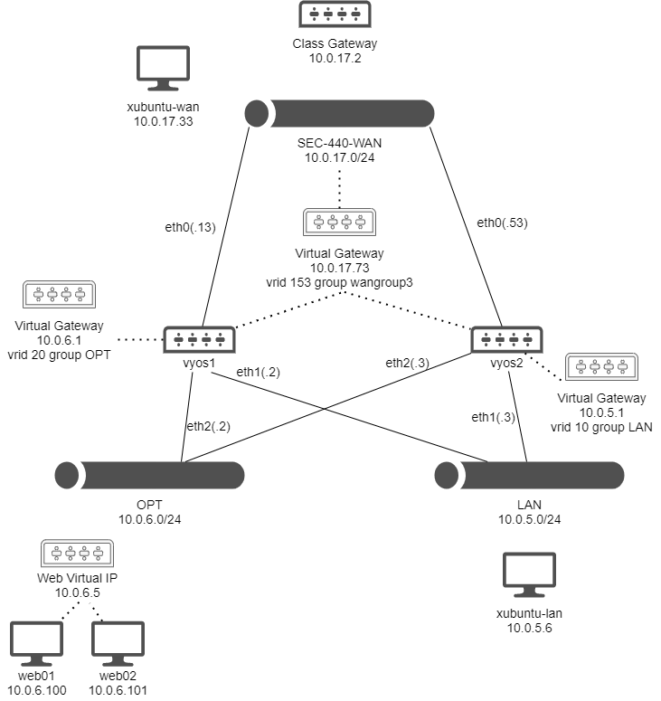

# Web Redundancy Lab

This lab addresses web redundancy with another layer of VRRP as a gateway for web services to listen on. This time, redundancy is accomplished using Keepalived on the same web servers. This will allow the two web servers to communicate and elect a corresponding web server when a request is made to a virtual address. Though proxy machines were provisioned and available for use, I found it to be easier to cut the proxy out of my configuration and just add another layer of VRRP.

[Video Link to Demonstration](https://drive.google.com/file/d/1sE_dMAtUHd5Qw4SutwwuHAg49TPItVsr/view?usp=sharing)

## Network Map

This week, the network diagram shifted with the addition of a new web server and placing both servers in the OPT network:



## Web02 Setup

Web02 was configured identically to Web01 in [the previous lab](../network_redundancy/network_redundancy.md) with the exception of a different network address and no multifactor authentication.

## Firewall changes

[Similar to last week](../network_redundancy/ansible_automation.md), an Ansible playbook was used to configure firewall changes at the start of this lab to try to reduce mistakes and typing commands twice. [This playbook](https://github.com/brandon-wilbur/sec440/blob/master/web_redundancy/week_two_firewall_ansible.yml) will do the following:

### OPT-to-WAN Firewall
* Allow established traffic out for web connections
* Temporarily allow all traffic out for Keepalived installation

### WAN-to-OPT
* Allow established traffic into the network for installs on web devices

### LAN-to-OPT
* Allow SSH port 22 for managing devices in OPT

### OPT-to-LAN
* Allow established traffic back into LAN for SSH communication

### NAT
* Allow masquerading for the OPT network so devices can communicate outside to the Internet
* Add destination rule for web requests to the WAN virtual address to route to the Keepalived address inside the OPT network

This isn't an exhaustive list of all changes that needed to happen to get everything to function correctly. Removing temporary rules and editing past NAT rules were done by hand in addition to running the playbook, but again this provided a concise place to document the major firewall changes that needed to happen. 

[VyOS1 Firewall Configuration](https://github.com/brandon-wilbur/sec440/blob/master/web_redundancy/vyos1_config_web_redundancy.txt)
[VyOS2 Firewall Configuration](https://github.com/brandon-wilbur/sec440/blob/master/web_redundancy/vyos2_config_web_redundancy.txt)

## Keepalived setup

Keepalived's setup was very easy in this scenario, as the service was running on the same hosts serving up web content.

On each host (CentOS 7), run the following to install the service and move the default configuration file out of the way:

```
sudo yum update -y && sudo yum -y install keepalived
sudo mv /etc/keepalived/keepalived.conf /etc/keepalived/keepalived.bak
```

Configuration of this service will rely on the file located at `/etc/keepalived/keepalived.conf`. For this scenario on web01, the file looked like this:

```
vrrp_sync_group loadbalance1 {
    group {
        web
    }
}
 
vrrp_instance web {
    state MASTER
    interface ens192
    virtual_router_id 50
    priority 100
    advert_int 1
    unicast_peer {
        10.0.6.101
    }
    virtual_ipaddress {
        10.0.6.5
    }
}
```

Likewise, the configuration looked like the following on web02:

```
vrrp_sync_group loadbalance1 {
    group {
        web
    }
}
 
vrrp_instance web {
    state BACKUP
    interface ens192
    virtual_router_id 50
    priority 99
    advert_int 1
    unicast_peer {
        10.0.6.100
    }
    virtual_ipaddress {
        10.0.6.5
    }
}
```

In short, this configuration file will:
* Establish a VRRP sync group called `loadbalance1` and a group called `web`
* Place web01 in `MASTER` status and set web02 to `BACKUP` status
* Assign a priority level of `100` to web01 and `99` to web02
* Tell both servers to check each other's health status every second
* Point both devices at each other for unicast health check communications
* Listen on the virtual IP address `10.0.6.5`

When a web server enters the `MASTER` state, it will assume the IP address `10.0.6.5` and service requests.

Finally, start Keepalived with `sudo systemctl start keepalived` and enable the service to start at boot with `sudo systemctl enable keepalived`.

[Keepalived web01 configuration file](https://github.com/brandon-wilbur/sec440/blob/master/web_redundancy/web01-keepalived.conf)
[Keepalived web02 configuration file](https://github.com/brandon-wilbur/sec440/blob/master/web_redundancy/web02-keepalived.conf)

## References
* [https://access.redhat.com/documentation/en-us/red_hat_enterprise_linux/7/html/load_balancer_administration/ch-initial-setup-vsa](https://access.redhat.com/documentation/en-us/red_hat_enterprise_linux/7/html/load_balancer_administration/ch-initial-setup-vsa)